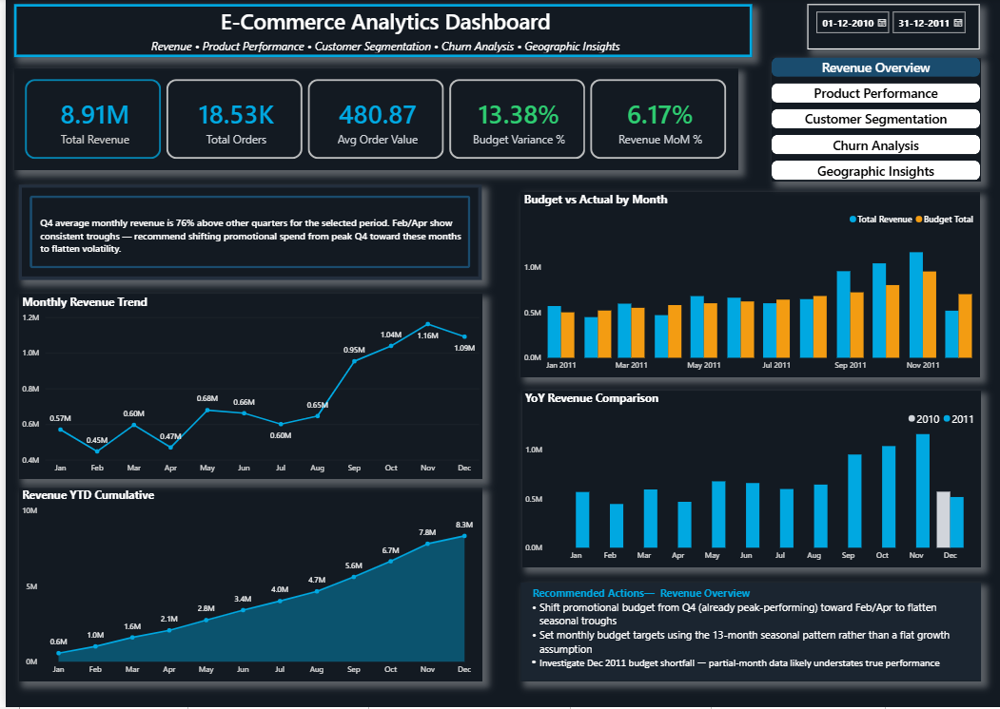
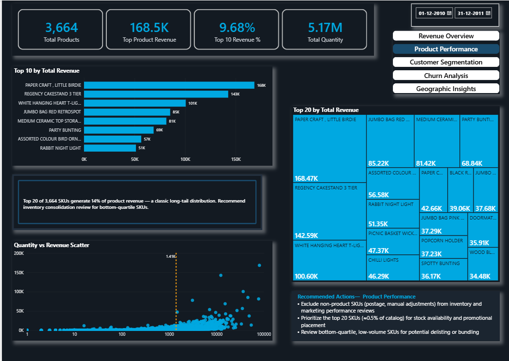
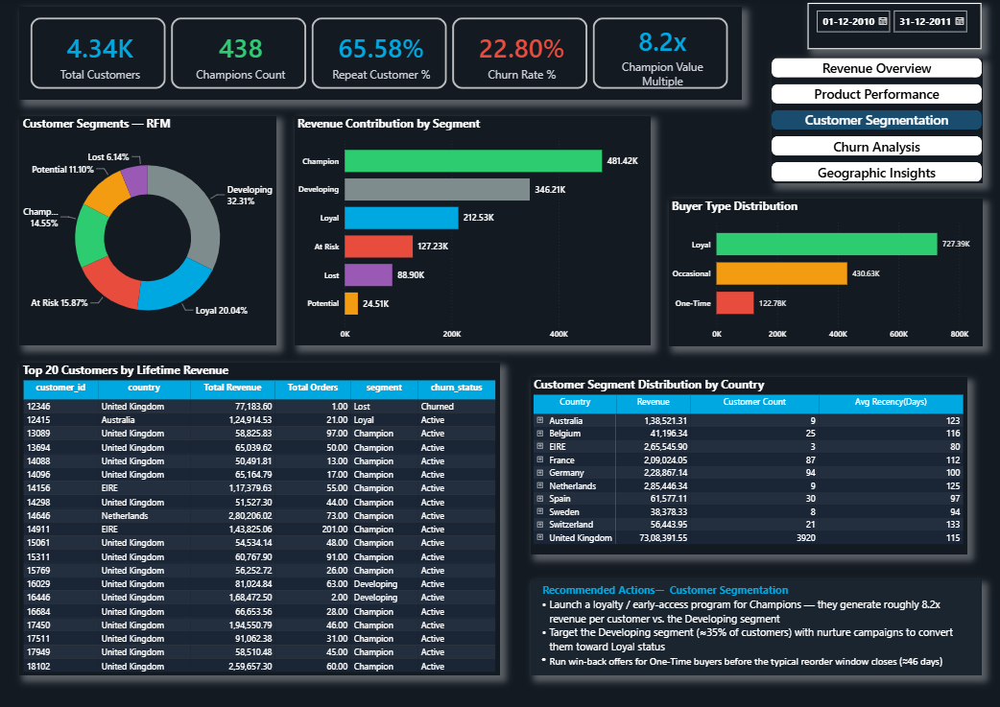
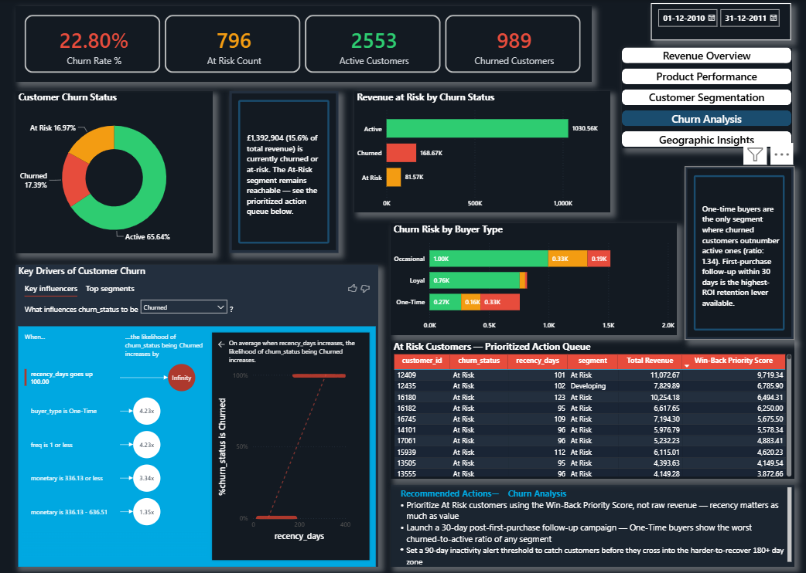
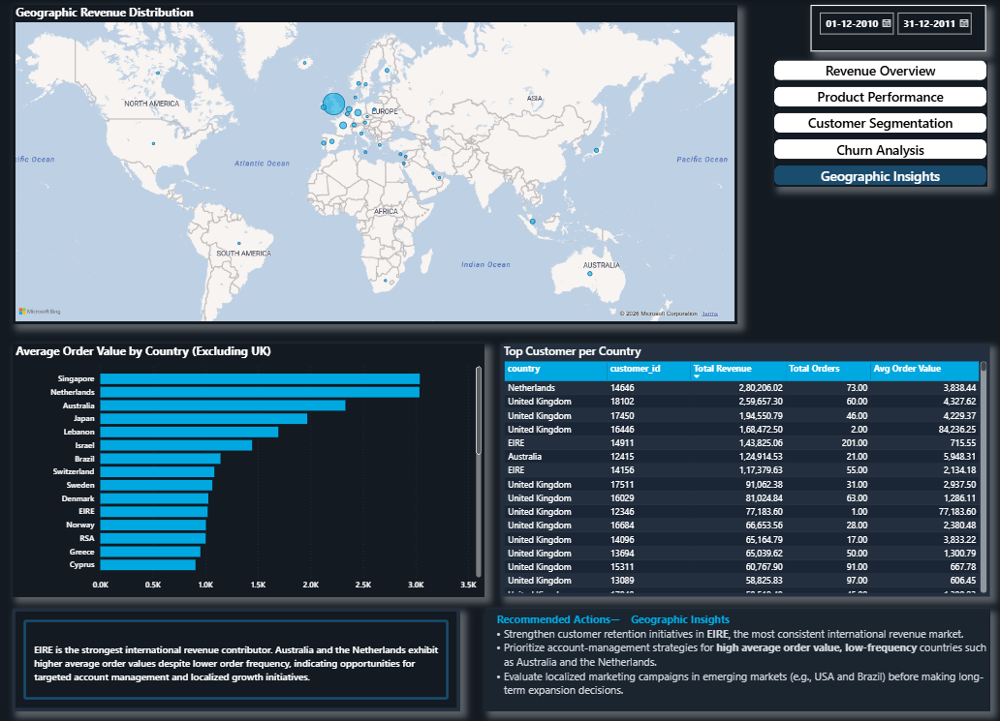

# E-Commerce Analytics Dashboard
### End-to-End Data Analytics Portfolio Project

**Tech Stack:** PostgreSQL · SQL · Power BI · DAX  
**Dataset:** UK Online Retail (541K+ transactions, Dec 2010 – Dec 2011)  
**Project Type:** Portfolio — Data Analyst

---

## Project Summary

Built an end-to-end analytics solution for a UK-based online gift retailer with no existing structured reporting. Loaded and cleaned 541K+ raw transactions in PostgreSQL, designed a dimensional star schema, developed 16 SQL modules for business analysis, and built a 5-page interactive Power BI dashboard featuring advanced DAX measures, custom tooltips, drill-through navigation, AI visuals, and business recommendation panels for Sales, Marketing, Operations, Customer Success, and Finance teams.

---

## Key Findings

- **£1.39M (15.6% of total revenue)** is currently churned or at-risk — highest-priority
  retention opportunity
- **Champions (10% of customers) generate 8.2x more revenue per customer** than the
  Developing segment (35% of customers) — loyalty program ROI is extremely high
- **One-time buyers are 4.23x more likely to churn** (Key Influencers AI visual,
  statistically derived) — first-purchase follow-up within 30 days is the
  highest-ROI retention lever
- **Q4 revenue averages 76% above other quarters** — Feb/Apr show consistent
  troughs, recommend shifting promotional spend toward these months
- **Top 20 SKUs (0.5% of 3,664 products) generate 14% of revenue** — classic
  Pareto long-tail, inventory consolidation opportunity
- **EIRE is the strongest international market** (consistent, frequent orders);
  Australia and Netherlands show high AOV but low frequency —
  likely wholesale accounts requiring account-management approach

---

## Data Model — Star Schema

The analytical data model follows a star schema optimized for reporting and dashboard performance.

**Fact Table**
- fact_orders

**Dimension Tables**
- dim_products
- dim_customers
- dim_date
- dim_budget

**Derived Analytical Table**
- rfm_segments
---

##SQL Analysis Modules(16)

| # | Query | Concepts Used |
|---|-------|---------------|
| 1 | Staging table + date fix | CREATE TABLE, ALTER DATABASE |
| 2 | Data profiling | CASE WHEN, COUNT, LIKE |
| 3–7 | Dimension + fact tables | CREATE TABLE AS SELECT, WHERE filters |
| 8 | MoM Revenue | CTE, DATE_TRUNC, LAG, NULLIF |
| 9 | YoY Comparison | EXTRACT, CASE WHEN pivot, GROUP BY |
| 10 | Running Total | Nested SUM OVER, window functions |
| 11 | Budget vs Actual | JOIN, CASE WHEN, variance formula |
| 12 | Top 10 Products | JOIN, RANK, LIMIT |
| 13 | RFM Segmentation | NTILE, CONCAT, multi-condition CASE WHEN |
| 14 | Churn Status | Date arithmetic, CASE WHEN thresholds |
| 15 | Cohort Retention | DATE_TRUNC, LEFT JOIN, INTERVAL |
| 16 | LAG/LEAD Orders | PARTITION BY, LAG, LEAD, DISTINCT |

---

## Interactive Power BI Dashboard — 5 Pages

### Page 1 — Revenue Overview
KPI cards · Monthly trend · Revenue YTD · Budget vs Actual · YoY comparison  
*Dynamic seasonality insight · Custom tooltip showing monthly snapshot on hover*

### Page 2 — Product Performance
Top 10 products · Revenue treemap · Quantity vs Revenue scatter  
*Drill-through to Product Detail page · Long-tail dynamic insight*

### Page 3 — Customer Segmentation
RFM donut · Revenue by segment · Buyer type · Top 20 customers table  
*Country→Segment Matrix drill-down · Customer Investigation drill-through*  
*Champion Value Multiple card (8.2x)*

### Page 4 — Churn Analysis
Churn status donut · Revenue at risk · Churn by buyer type  
*Key Influencers AI visual · Win-Back Priority Score prioritized action queue*  
*Dynamic revenue-at-risk text · One-time buyer churn ratio insight*

### Page 5 — Geographic Insights
Global revenue map · AOV by country · Top customer per country · International revenue distribution and market opportunity analysis
*EIRE vs Australia/Netherlands strategic insight*

---

## Screenshots

### Revenue Overview

### Product Performance

### Customer Segmentation

### Churn Analysis

### Geographic Insights

---

## Advanced Features Built

| Feature | Where |
|---------|-------|
| Custom tooltip page | Page 1 — monthly snapshot on hover |
| Product Detail drill-through | Page 2 → triggered from Top 10 bar |
| Customer Investigation drill-through | Page 3 → triggered from customer table |
| Key Influencers AI visual | Page 4 — statistical churn drivers |
| Win-Back Priority Score | Page 4 — recency-weighted action queue |
| Country→Segment Matrix | Page 3 — hierarchical drill-down |
| Dynamic DAX insight text | All 5 pages — recalculates with slicer |
| Dynamic Business Recommendation Panels | All 5 pages — actionable bullets |
| Cross-filtering & Edit Interactions (Highlight) | All 5 pages |

---

## Business Impact

| Stakeholder | Pain Point Solved | Deliverable |
|-------------|------------------|-------------|
| Sales Director | No YoY visibility | MoM + YoY trend with dynamic insight |
| Marketing Head | No customer behaviour visibility | RFM segmentation, buyer type, Champion Multiple |
| Operations Head | Unknown revenue-driving products | Top 10, Pareto long-tail analysis |
| Customer Success | No churn early-warning | Key Influencers + Win-Back Priority Queue |
| Finance Team | Manual Excel budget tracking | Budget vs Actual variance dashboard |

---
## Technologies Used

- PostgreSQL
- SQL
- Power BI Desktop
- DAX
- Power Query
- Data Modeling
- Star Schema
- ETL
- Data Visualization

---
ecommerce-analytics-dashboard/
│
├── dashboard/
│   ├── Ecommerce Dashboard.pbix
│   ├── Ecommerce Dashboard.pdf
│   ├── REVENUE.PNG
│   ├── PRODUCT.png
│   ├── CUSTOMER.png
│   ├── CHURN.png
│   └── GEOGRAPHICAL.png/
│
├── data/
│   └── rfm_segments.csv/
│
├── sql/
│   ├── Staging & Profiling
│   ├── Dimension & Fact Tables
│   ├── Revenue Analysis
│   ├── Product Analysis
│   ├── Customer RFM
│   ├── Churn Analysis
│   └── Window Functions/
│
└── README.md
---
## How to Run

1. Clone the repository.
2. Execute the SQL scripts in PostgreSQL to prepare the analytical data model.
3. Open the Power BI report (`Ecommerce Dashboard.pbix`).
4. Refresh the data model if required.
5. Explore the interactive dashboard using slicers, drill-through pages, and custom tooltips.
> **Note:** The repository includes the complete Power BI (.pbix) file, allowing users to explore interactive features such as drill-through navigation, custom tooltips, cross-filtering, AI visuals, and dynamic DAX calculations.
----
